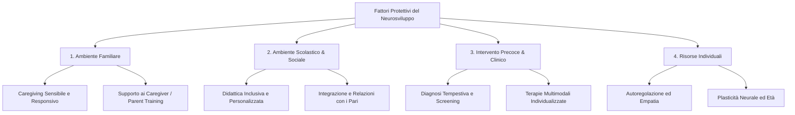

# Fattori Protettivi nei Disturbi del Neurosviluppo

I **fattori protettivi** nei disturbi del neurosviluppo (come il Disturbo dello Spettro Autistico, l'ADHD, i Disturbi Specifici dell'Apprendimento, ecc.) rappresentano variabili, condizioni o risorse che mitigano l'impatto dei fattori di rischio, promuovono l'adattamento e favoriscono traiettorie evolutive positive. 

Nello studio del neurosviluppo, lo sviluppo individuale è inteso come un processo dinamico e probabilistico, regolato dall'interazione continua tra biologia (genetica, epigenetica) e ambiente. In questo contesto, i fattori protettivi non sono semplicemente l'assenza di rischio, ma forze attive che interagiscono con le vulnerabilità del soggetto.

---

## 1. Spiegazione Concettuale: Il Modello della Bilancia Dinamica

Per comprendere i fattori protettivi, si può utilizzare l'analogia della **bilancia dello sviluppo**:
* **Fattori di Rischio (Risk Factors):** Pesi posizionati su un piatto della bilancia (es. predisposizione genetica, prematurità extreme, stress familiare, tossine ambientali).
* **Fattori Protettivi (Protective Factors):** Pesi posizionati sul piatto opposto o modificatori del fulcro della bilancia. Essi aiutano a mantenere la bilancia in equilibrio (resilienza) anche quando i fattori di rischio aumentano.
* **Il Fulcro (Resilience/Plasticity):** Rappresenta la capacità intrinseca del cervello e dell'organismo di riorganizzarsi (plasticità neurale) ed adattarsi alle avversità.

Un fattore protettivo può agire in tre modi:
1. **Riducendo l'impatto del rischio:** Alterando l'esposizione o il significato del fattore di rischio (es. un genitore preparato riduce l'impatto dello stress associato alle difficoltà di comunicazione del bambino).
2. **Interrompendo le reazioni a catena negative:** Evitando che una difficoltà iniziale provochi problemi successivi (es. una diagnosi precoce previene l'insorgenza di disturbi d'ansia secondari).
3. **Promuovendo l'autostima e l'auto-efficacia:** Attraverso relazioni di supporto e successi scolastici/personali.

---

## 2. Analisi Approfondita delle Categorie di Fattori Protettivi

La letteratura scientifica suddivide i fattori protettivi in quattro macro-aree interconnesse:



### A. Ambiente Familiare e Relazionale (Micro-livello)
La famiglia costituisce il primo e più importante "ammortizzatore" dello sviluppo.
* **Caregiving sensibile e responsivo:** La presenza di genitori stabili, caldi e in grado di comprendere e rispondere adeguatamente ai segnali del bambino (anche non verbali) favorisce un attaccamento sicuro. Questo è fondamentale per la regolazione dello stress e dello sviluppo emotivo.
* **Supporto e formazione per i genitori (Parent Training):** Aiutare i genitori a comprendere il funzionamento neurodivergente del figlio riduce lo stress genitoriale, migliora l'autoefficacia percepita e ottimizza le risposte educative quotidiane.

### B. Ambiente Scolastico e Sociale (Meso-livello)
La scuola rappresenta il principale contesto extra-familiare in cui si negozia l'inclusione.
* **Didattica flessibile e personalizzata:** L'adozione di piani educativi mirati (come PEI o PDP) che valorizzino i punti di forza dello studente anziché focalizzarsi esclusivamente sulle lacune.
* **Clima scolastico inclusivo e relazioni positive con i pari:** La prevenzione del bullismo e la promozione di attività collaborative (peer tutoring, apprendimento cooperativo) riducono il rischio di isolamento sociale ed elevano l'autostima.

### C. Diagnosi Precoce ed Interventi Tempestivi (Livello Clinico/Sistemico)
La tempestività dell'azione clinica sfrutta una delle più grandi risorse biologiche dell'infanzia: la **plasticità cerebrale**.
* **Identificazione e diagnosi precoce:** Intercettare le atipie di sviluppo nei primi anni di vita consente di avviare programmi riabilitativi quando i circuiti cerebrali sono altamente modellabili.
* **Interventi multimodali e personalizzati:** Percorsi terapeutici che integrano aspetti cognitivo-comportamentali, logopedici, psicomotori e di supporto psicoeducativo strutturati sul profilo specifico (e non solo sulla diagnosi categoriale) del bambino.

### D. Risorse Individuali (Livello Intrinseco)
Fattori legati alle caratteristiche biologiche e psicologiche del soggetto.
* **Capacità di autoregolazione:** L'abilità di modulare i propri stati emotivi, attentivi e comportamentali funge da forte barriera contro la psicopatologia secondaria (es. ansia o depressione).
* **Quoziente Intellettivo (QI) e funzioni esecutive preservate:** Buone abilità cognitive di base consentono di sviluppare strategie di compensazione efficaci di fronte a specifiche difficoltà (ad esempio, compensare un deficit fonologico con una memoria visiva eccellente).

---

## 3. Suggerimenti Clinici ed Educativi (Strength-Based Approach)

Tradizionalmente, la clinica si è concentrata sulla rimozione o riduzione dei deficit. I modelli più moderni suggeriscono invece un approccio basato sui punti di forza (**Strength-Based Approach**):
1. **Mappatura delle risorse:** In fase di valutazione diagnostica, è fondamentale compilare una lista sistematica dei fattori protettivi del bambino e del suo contesto, non solo delle sue compromissioni.
2. **Promozione della neurodiversità:** Educare l'ambiente circostante a considerare le differenze neurologiche come variazioni del funzionamento umano, riducendo lo stigma e adattando le richieste ambientali alle reali capacità del soggetto.

---

## 4. Modello Computazionale (TypeScript)

Per illustrare come queste dinamiche di rischio e protezione possano essere formalizzate e analizzate in sistemi di supporto decisionale clinico o database di ricerca, di seguito viene proposto un modello strutturato in **TypeScript**.

Questo codice definisce le entità cliniche e implementa un algoritmo per valutare l'indice di resilienza ed equilibrio evolutivo di un profilo diagnostico.

```typescript
// Definizione delle tipologie di fattori
export type FactorSeverity = 'low' | 'medium' | 'high';

export interface RiskFactor {
  id: string;
  name: string;
  category: 'biological' | 'environmental' | 'family';
  impact: number; // Valore da 1 a 10 (peso del rischio)
  severity: FactorSeverity;
}

export interface ProtectiveFactor {
  id: string;
  name: string;
  category: 'family_support' | 'clinical_intervention' | 'school_inclusion' | 'individual_resource';
  mitigationValue: number; // Valore da 1 a 10 (capacità di mitigazione)
  isActive: boolean;
}

export interface PatientProfile {
  patientId: string;
  ageInMonths: number;
  primaryDiagnosis?: string;
  riskFactors: RiskFactor[];
  protectiveFactors: ProtectiveFactor[];
  neuroplasticityFactor: number; // Moltiplicatore basato sull'età (più giovane = maggiore plasticità)
}

/**
 * Calcola l'indice di bilanciamento evolutivo.
 * Un punteggio > 0 indica una traiettoria evolutiva protetta/resiliente.
 */
export function calculateDevelopmentalBalance(profile: PatientProfile): {
  totalRisk: number;
  totalProtection: number;
  balanceScore: number;
  resilienceCategory: 'Vulnerabile' | 'Moderata' | 'Altamente Protetta';
} {
  // Calcolo del rischio totale
  let totalRisk = profile.riskFactors.reduce((acc, rf) => {
    let multiplier = 1;
    if (rf.severity === 'medium') multiplier = 1.5;
    if (rf.severity === 'high') multiplier = 2.0;
    return acc + (rf.impact * multiplier);
  }, 0);

  // Calcolo della protezione totale (influenzata anche dal fattore di neuroplasticità precoce)
  let totalProtection = profile.protectiveFactors
    .filter(pf => pf.isActive)
    .reduce((acc, pf) => acc + pf.mitigationValue, 0);

  // Applica il fattore di plasticità alla protezione (gli interventi precoci valgono di più)
  totalProtection = totalProtection * profile.neuroplasticityFactor;

  // Calcolo del bilancio finale
  const balanceScore = Number((totalProtection - totalRisk).toFixed(2));

  // Categorizzazione clinica
  let resilienceCategory: 'Vulnerabile' | 'Moderata' | 'Altamente Protetta';
  if (balanceScore < -5) {
    resilienceCategory = 'Vulnerabile';
  } else if (balanceScore >= -5 && balanceScore <= 5) {
    resilienceCategory = 'Moderata';
  } else {
    resilienceCategory = 'Altamente Protetta';
  }

  return {
    totalRisk: Number(totalRisk.toFixed(2)),
    totalProtection: Number(totalProtection.toFixed(2)),
    balanceScore,
    resilienceCategory
  };
}

// Esempio di utilizzo clinico del modello
const diagnosticProfile: PatientProfile = {
  patientId: "PAT-2026-09",
  ageInMonths: 42, // 3 anni e mezzo (età ottimale per plasticità)
  primaryDiagnosis: "Sospetto Disturbo dello Spettro Autistico",
  riskFactors: [
    { id: "RF1", name: "Familiarità per disturbi del linguaggio", category: "biological", impact: 4, severity: "medium" },
    { id: "RF2", name: "Marcate difficoltà nella comunicazione sociale", category: "biological", impact: 8, severity: "high" }
  ],
  protectiveFactors: [
    { id: "PF1", name: "Genitori collaborativi e formato (Parent Training)", category: "family_support", mitigationValue: 7, isActive: true },
    { id: "PF2", name: "Logopedia e intervento comportamentale avviati", category: "clinical_intervention", mitigationValue: 9, isActive: true },
    { id: "PF3", name: "Inserimento alla scuola dell'infanzia con supporto", category: "school_inclusion", mitigationValue: 6, isActive: true }
  ],
  neuroplasticityFactor: 1.8 // Elevato coefficiente dovuto alla diagnosi e terapia precoce
};

const evaluation = calculateDevelopmentalBalance(diagnosticProfile);
console.log(`Punteggio Bilancio Evolutivo: ${evaluation.balanceScore}`);
console.log(`Categoria di Resilienza: ${evaluation.resilienceCategory}`);
```

---

## 5. Sintesi Comparativa dei Concetti Chiave

| Aspetto | Fattori di Rischio | Fattori Protettivi |
| :--- | :--- | :--- |
| **Definizione** | Condizioni che aumentano la probabilità di un outcome disfunzionale. | Risorse che riducono l'effetto del rischio o migliorano l'adattamento. |
| **Focus principale** | Vulnerabilità biologiche, stress ambientali, deficit intrinseci. | Supporto familiare, diagnosi precoce, inclusione scolastica, resilienza. |
| **Obiettivo Clinico** | Prevenzione primaria, mitigazione e gestione. | Potenziamento delle risorse, supporto sistemico, strength-based design. |
| **Interazione biologica** | Possono limitare o alterare le traiettorie di cablaggio neuronale. | Sfruttano la plasticità cerebrale per creare percorsi compensativi. |

---

## 6. Autovalutazione

Per verificare la tua preparazione su questi argomenti, puoi svolgere il quiz a scelta multipla dedicato:
* [Quiz: Fattori Protettivi nei Disturbi del Neurosviluppo](file:///Users/elisarossari/lili-projects/second-brain/Universita/Disturbi%20del%20Neurosviluppo/Esercizi/fattori_protettivi_quiz.md)

---

## 7. Risorse e Letture Consigliate

1. [Istituto Superiore di Sanità (ISS) - Disturbi dello Spettro Autistico](https://www.iss.it/) (Linee guida nazionali per la diagnosi e il trattamento).
2. [Center on the Developing Child - Harvard University](https://developingchild.harvard.edu/) (Ricerche seminali sulla resilienza infantile e l'impatto delle relazioni di caregiving).
3. [Frontiers in Psychiatry - Neurodevelopmental Disorders](https://www.frontiersin.org/journals/psychiatry) (Studi clinici sulle traiettorie evolutive e l'efficacia degli interventi precoci).
